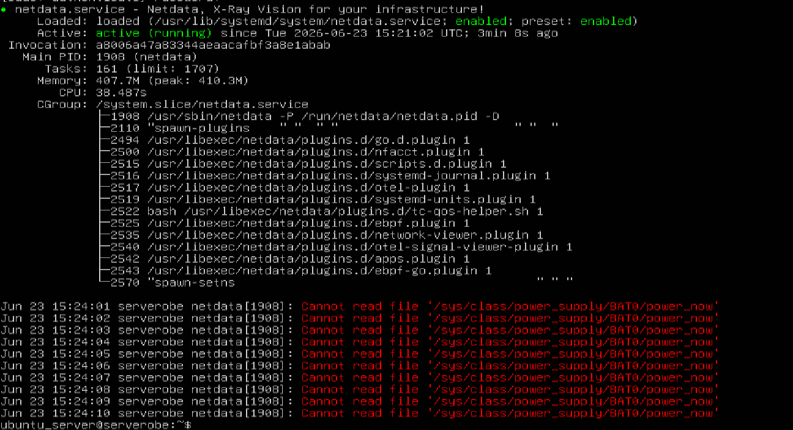

<div align="center">

# ☁️ Simulasi Perbandingan Biaya Server Fisik dan Cloud Free Tier Menggunakan VirtualBox

### 📚 Proyek UAS Mata Kuliah Transformasi Digital

**Universitas Pancasakti Tegal**  
Program Studi Sistem Informasi  
Tahun Akademik 2025/2026

**Disusun oleh :**  
**Salman Ardian Arkaan**  
**NIM : 6725600008**

---


</div>

---

# 📖 Deskripsi Proyek

Proyek ini merupakan **studi analisis** yang membandingkan penggunaan **Server Fisik (On-Premise)** dengan **Cloud Free Tier (Google Drive)** menggunakan lingkungan virtual berbasis **VirtualBox**.

Penelitian berfokus pada:

- Analisis biaya implementasi
- Analisis penggunaan sumber daya server
- Efisiensi penyimpanan cloud
- Monitoring performa server menggunakan Netdata

---

# 🎯 Tujuan Penelitian

✅ Membangun simulasi server lokal menggunakan VirtualBox

✅ Mengimplementasikan Ubuntu Server

✅ Mengintegrasikan Google Drive sebagai Cloud Storage

✅ Melakukan monitoring server menggunakan Netdata

✅ Membandingkan biaya Server Lokal dan Cloud Free Tier

---

# 🛠 Teknologi yang Digunakan

| Teknologi | Kegunaan |
|-----------|----------|
| 🖥 VirtualBox | Virtualisasi Server |
| 🐧 Ubuntu Server | Sistem Operasi Server |
| 📊 Netdata | Monitoring Server |
| ☁ Google Drive | Cloud Storage |
| 📈 Microsoft Excel | Dataset Evaluasi |
| 📄 Microsoft Word | Laporan Proyek |
| 📑 Microsoft PowerPoint | Presentasi |

---

# 📂 Struktur Repository

```text
UAS-TransformasiDigital-6725600008
│
├── 📄 README.md
├── 📁 dataset
│   └── Dataset Evaluasi.xlsx
├── 📁 laporan
│   └── Laporan Proyek.docx
├── 📁 presentasi
│   └── Presentasi.pdf
├── 📁 dokumentasi
│   ├── virtualbox.png
│   ├── ubuntu-server.png
│   ├── netdata.png
│   ├── google-drive.png
│   ├── upload-test.png
│   └── website.png
└── 📁 video
    └── Link Video Presentasi.txt
```

---

# 🔄 Alur Proyek

```text
Persiapan
     │
     ▼
VirtualBox
     │
     ▼
Ubuntu Server
     │
     ▼
Netdata
     │
     ▼
Google Drive
     │
     ▼
Pengujian Upload
     │
     ▼
Analisis Biaya
     │
     ▼
Kesimpulan
```

---

# 📊 Hasil Analisis

| Aspek | Server Lokal | Cloud Free Tier |
|-------|--------------|-----------------|
| Investasi Awal | Tinggi | Gratis |
| Listrik | Ada | Tidak Ada |
| Maintenance | Ada | Tidak Ada |
| Penyimpanan | Bergantung Hardware | 15 GB Gratis |
| Kontrol Data | Sangat Tinggi | Terbatas |
| Skalabilitas | Manual | Mudah |

---

# 📈 Kesimpulan Penelitian

Berdasarkan hasil simulasi diperoleh bahwa:

✅ Server Lokal memberikan kontrol penuh terhadap data dan konfigurasi.

✅ Google Drive Free Tier menawarkan efisiensi biaya yang tinggi.

✅ Netdata berhasil melakukan monitoring server secara real-time.

✅ Cloud Storage cocok digunakan untuk kebutuhan backup maupun penyimpanan data berskala kecil hingga menengah.

---

# 📷 Dokumentasi Implementasi

## VirtualBox


```markdown

```

---

## Ubuntu Server


```markdown

```

---

## Dashboard Netdata


```markdown

```

---

## Google Drive


```markdown

```

---

## Pengujian Upload File


```markdown

```

---

# 📂 Dokumen

| Dokumen | Lokasi |
|---------|--------|
| 📄 Laporan | `laporan/` |
| 📊 Dataset | `dataset/` |
| 📑 Presentasi | `presentasi/` |

---

# 🎥 Video Presentasi

📺 Link Video:

https://drive.google.com/file/d/1zdnyhNgdcCEm5PVwgajYBBsXgGYpJkTN/view?usp=sharing

---

# 👨‍🎓 Penulis

**Salman Ardian Arkaan**

NIM : **6725600008**

Program Studi Sistem Informasi

Universitas Pancasakti Tegal

---

<div align="center">

### ⭐ Terima kasih telah mengunjungi repository ini ⭐

</div>
